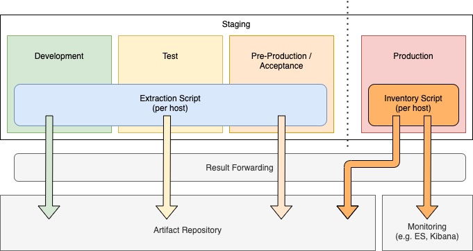

# metaeffekt-inventory-script

Scripts for creating an inventory of software components on a machine.

The scripts are primarily intended to be used in production environment and 
run with minimal resource consumption profile.

The script produces outputs in ``/var/opt/metaeffekt/inventory``. These can
be forwarded (e.g. using file beat or other means) for aggregation and 
further analysis.



The figure illustrates how the script can be applied in a staged environment.

For aggregating in-depth ost analysis data in a non-production environment
use the {metæffekt} extraction script.

## Installation

Once you have built a package, install it using your operating system’s package manager.
As of writing this, the repository contains packaging scripts for RPM and DEB packages.

`# dnf install [filename]`

`# apt install ./[filename]`

With apt, use ./ at the beginning. Otherwise it may not recognize your deb file as a file, search for the filename as a package name and print “unable to locate package”.

## Configuration

The package itself does not require special configuration to run. It does take parameters from the command line though.

The output is made to be read by filebeat.
Processing scripts might expect well-formed json lines as input, therefore filebeat should be configured to put the script's data in its own separate index.

A basic filebeat configuration may look like this:
```
# Input
- type: log
  index: "ae-inventory-%{[agent.version]}-%{+yyyy.MM.dd}"
  enabled: true
  json.keys_under_root: false
  close_renamed: true
  close_removed: true
  clean_removed: true
  paths:
    - /var/opt/metaeffekt/inventory/inventory-out.json

# If this is the only input and ilm isn't used, uncomment
# this line to disable ilm. If ilm is enabled, an extra
# empty index will be automatically created since the
# input's index override is not effective for setup.
#setup.ilm.enabled: false
```

## Running the Scripts

To run the scripts, execute the shell script for your particular operating system with appropriate parameters.

The scripts require at least one parameter to run: Either "--full" or "--update" to
decide whether to output all available system information or just output changes.

Other possible arguments are:
 - \-t \<machineTag\> : Adds a tag to sent host objects when running with "--full".
   This exists so that a custom Identifier can be set.
   It should consist only of characters as allowed for base64 encoded strings
   (alphanumeric plus . and /).
